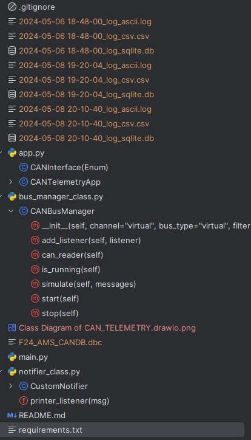
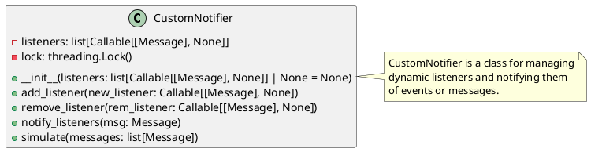

# can-telemetry
General purpose CAN telemetry tool written in Python 3 

## TODO:
change where files are read from and extracted

They are currently read from the root. this needs to change according to our project structure

### Purpose of this Tool:
If any hardware runs CAN, this application should be able to simulate both the send and receive comms, down to the
capability of running _signals-based-unit-tests_.

### Project Structure
```graphql
can_tool/
│  
├── src/  
│   ├── main.py                   # Main entry point for the application  
│   ├── bus_types.py              # Module for the BusTypes enum
│   ├── can_interface.py          # Module for handling CAN communication
│   ├── can_manager.py            # Module for managing the CAN tool  
│   ├── custom_notifier.py        # Module for CustomNotifier class
│   ├── db_manager.py             # Module for SQLite-based storage and logging  
│   ├── dbc_parser.py             # Module for DBC file parsing and message encoding/decoding  
│   ├── config_manager.py         # Module for managing configurations (TOML)  
│   └── gui/  
│       ├── main_window.py        # PyQt6 main window setup  
│       └── plot_widget.py        # Custom PyQt6 widget for plotting (Matplotlib)  
│  
├── configs/  
│   ├── example_config1.toml     # Example TOML configuration files  
│   └── example_config2.toml  
│  
├── dbc_files/  
│   ├── can_database.dbc         # DBC files for CAN message decoding  
│   └── other_dbc_file.dbc  
│  
├── data/                         # Directory for storing logged data of their respective types
│   └── ascii/                    # SQLite database for logging CAN messages  
│   └── csv/                      # SQLite database for logging CAN messages  
│   └── sqlite/                   # SQLite database for logging CAN messages  
│  
├── tests/                        # Directory for storing diagnostic test scripts  
│   ├── battery_voltage_test.py  
│   ├── throttle_percentage_test.py  
│   ├── can_bus_health_test.py  
│   ├── ecu_communication_test.py  
│   └── error_code_read_test.py  
│  
├── Dockerfile                   # Dockerfile for containerization  
├── requirements.txt             # Python dependencies  
└── README.md                    # Project documentation
```

### Example Diagnostic Tests (`tests/`):

- **battery_voltage_test.py**: A test to measure the battery voltage of the vehicle. This test could include steps to 
send a request for battery voltage measurement and then parse the response to extract the voltage value.

- **throttle_percentage_test.py**: A test to measure the throttle position percentage. This test could involve sending a
request for throttle position data and then decoding the response to calculate the throttle position percentage.

- **can_bus_health_test.py**: A test to check the health of the CAN bus. This test could involve sending a series of
test messages and checking for proper responses to ensure that the CAN bus is functioning correctly.

- **ecu_communication_test.py**: A test to verify communication with an Electronic Control Unit (ECU). This test could
involve sending a request for ECU identification data and then checking the response to ensure that it matches the
expected values.

- **error_code_read_test.py**: A test to read error codes from the vehicle's diagnostic system. This test could involve
sending a request for error code data and then parsing the response to extract the error codes.

These tests can be implemented as Python scripts that use your tool's CAN communication functionality to interact with
the vehicle's diagnostic system. They can be run manually or as part of an automated test suite to verify the
functionality of the vehicle's systems.

### What are Custom Dynamic Notifiers?
Custom dynamic notifiers are a way to manage and notify listeners of events or messages in a flexible and customizable
manner.
This logic is handled by custom_notifier.py. 
The reason for the name is two-fold:
> the term "custom" generally means that the notifier is designed to be flexible and adaptable to different
> requirements. It allows developers to customize the behavior of the notifier by adding and removing listeners at
> runtime, hence the term "dynamic." This customization enables the notifier to be tailored to specific use cases 
> without needing to modify its core implementation.

The CustomNotifier class serves a generic class that acts as the parent for the can manager in our app


### Difference between the various can modules
The `can_manager.py` and `can_interface.py` modules serve different purposes and have distinct roles in our application.
Here's a breakdown of the differences in their goals, requirements, and roles:

1. **can_manager.py**:

   - **Goal**: The goal of `can_manager.py` is to manage and orchestrate the overall functionality of your CAN tool. It serves as a higher-level manager that coordinates the interaction between different components of your application, such as the `CanInterface`, `CustomNotifier`, and other modules.
   
   - **Requirements**: `can_manager.py` should be able to send and receive CAN message, manage listeners for received messages, handle configuration and settings, and coordinate the overall behavior of the CAN tool.
   
   - **Roles**:
     - Manages the `CanInterface` for sending and receiving CAN message.
     - Manages the `CustomNotifier` for notifying listeners of received messages.
     - Handles configuration loading and management.
     - Coordinates the overall behavior of the CAN tool, including message parsing, logging, and diagnostic testing.

2. **can_interface.py**:

   - **Goal**: The goal of `can_interface.py` is to provide an interface for interacting with the CAN bus. It handles the low-level communication details, such as sending and receiving CAN message, managing the CAN bus interface, and handling errors and exceptions.
   
   - **Requirements**: `can_interface.py` should be able to initialize the CAN bus interface, send and receive CAN message, handle errors and exceptions related to CAN communication, and provide a simple interface for other modules to interact with the CAN bus.
   
   - **Roles**:
     - Initializes and manages the CAN bus interface.
     - Sends CAN message over the CAN bus.
     - Receives CAN message from the CAN bus.
     - Handles errors and exceptions related to CAN communication.

### Maintenance tasks
- regularly review and update our requirements.txt file to incorporate bug fixes and security updates while
ensuring compatibility with our codebase